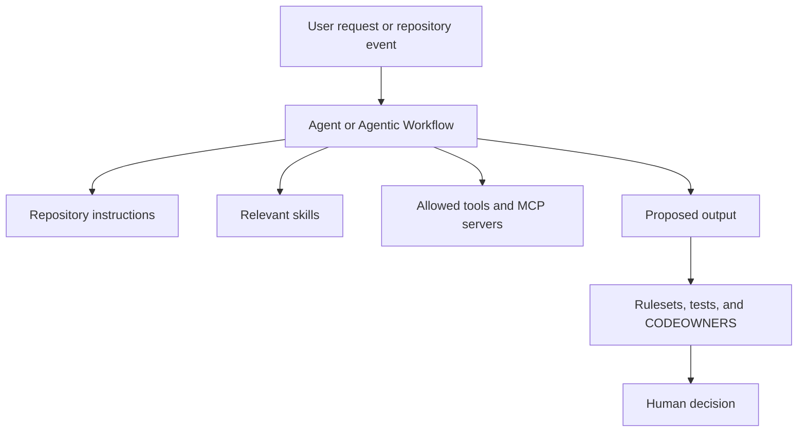
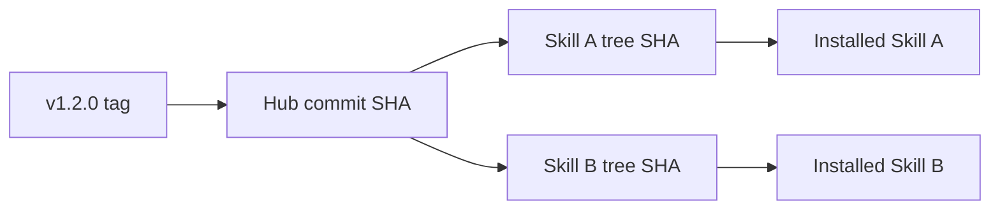
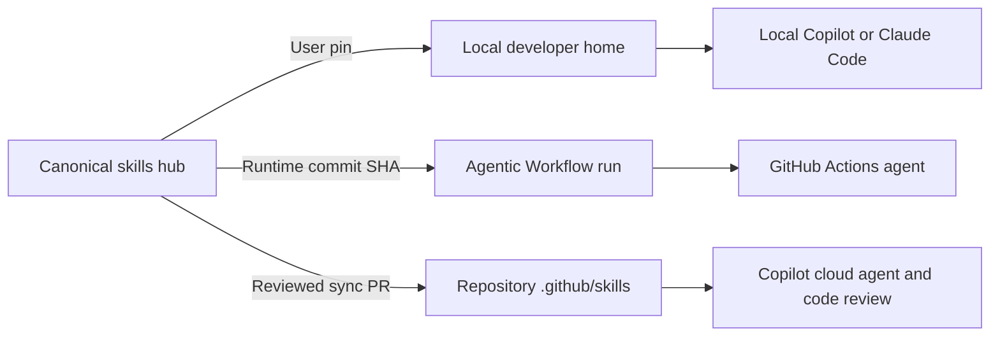

# Reusable Agent Primitives: Concepts and Mental Models

## Purpose

This document is educational. Product behavior, preview status, supported
paths, and command defaults can change. Verify current official documentation
before a production rollout.

Last verified: September 3, 2026, using GitHub CLI 2.96.0 and the current
official GitHub, GitHub Agentic Workflows, Agent Skills, and Claude Code
documentation.

## The shortest useful mental model

An AI development environment needs several different kinds of reusable
context:

| Primitive | Question it answers | Example |
| --- | --- | --- |
| Skill | "How should this task be performed?" | How to produce a design or review code |
| Repository instruction | "What is always true in this repository?" | Build commands, architecture, coding rules |
| Custom agent | "What role should perform the task, with which tools?" | A read-only reviewer or implementation orchestrator |
| Agentic Workflow | "When and under what controls should the task run automatically?" | Investigate a CI failure and open a draft PR |
| MCP server or tool | "What external capability or data can the agent call?" | Query an issue tracker or internal service |
| Ruleset and CODEOWNERS | "Who must review and what may be merged?" | Require platform approval for skill changes |

Do not combine all of these into one large prompt. They have different scopes,
owners, risk levels, and release cycles.



The agent proposes work. Governance still decides whether that work enters the
default branch.

---

## 1. Two separate decisions: primitive and scope

Do not use scope to decide which primitive to create. These are two independent
questions:

1. **What kind of thing is this?** Choose a skill, instruction, custom agent,
   workflow, tool, or governance control based on the job it performs.
2. **Who or what needs to receive it?** Choose the narrowest delivery scope that
   reaches every intended consumer.

For example, "review code using this checklist" is a **skill** regardless of
scope. That same skill can be delivered differently:

| Delivery scope | Who receives the same `review-code` skill |
| --- | --- |
| User/personal | One developer's local client across projects |
| Repository/project | Team members and supported agents working in one repository |
| Workflow run | One Agentic Workflow execution |

The primitive stays the same; only its audience and delivery mechanism change.

### What each scope means

| Scope | Audience or lifetime |
| --- | --- |
| Enterprise-managed | Everyone governed by enterprise policy |
| Organization | Members or repositories in one organization |
| Repository/project | People and supported agents working in one repository |
| User/personal | One developer across their local projects |
| Local-only | One user in one checkout |
| Workflow run | One automation execution |

Not every product supports every primitive at every scope. For example, GitHub
provides an organization repository mechanism for custom agents, while Agent
Skills in this design use user, repository, or workflow-runtime delivery.
Later sections explain the supported paths for each primitive.

### A practical sequence

First classify the content:

- repository fact or universal project rule -> repository instruction;
- reusable task procedure -> skill;
- specialized role and tool set -> custom agent;
- event-driven automation -> Agentic Workflow;
- mandatory merge or access rule -> enforceable governance control.

Then choose the narrowest supported scope that reaches the intended audience.
A personal formatting preference should remain user-scoped. A team skill that
must reach cloud agents should be repository-scoped. A skill needed only by one
Agentic Workflow can be installed for that workflow run.

Instructions and skills are context, not security boundaries. Use permissions,
hooks, rulesets, environments, and human review when a rule must be enforced.

---

## 2. Agent Skills

### What a skill is

An Agent Skill is a directory containing at least `SKILL.md`.

```text
generate-design/
|-- SKILL.md
|-- references/
|   `-- design-template.md
|-- scripts/
`-- assets/
```

`SKILL.md` contains YAML frontmatter followed by Markdown instructions:

```markdown
---
name: generate-design
description: Create a reviewable HLD and LLD for a bounded software change. Use before implementation when architecture and interfaces must be agreed.
---

Follow the design procedure...
```

The open Agent Skills specification requires:

- `name`;
- `description`;
- a directory name that matches `name`;
- lowercase letters, numbers, and hyphens in the name.

Optional fields and client extensions can add compatibility information,
metadata, invocation controls, or tool permissions. A field supported by one
client may be ignored by another. Keep the core behavior in portable Markdown
and isolate vendor-specific features.

### Discovery and progressive loading

Agents do not need to load every full skill into every conversation.

Conceptually:

1. The client discovers skill names and descriptions.
2. It compares the request with each description.
3. It loads the selected `SKILL.md` instructions.
4. It reads scripts or references only when needed.

This is why the description is operationally important. A vague description
causes missed or incorrect activation.

Weak:

```yaml
description: Helps with code.
```

Better:

```yaml
description: Review a diff for high-confidence correctness, security, and requirement-drift defects. Use when a pull request needs actionable findings without style-only noise.
```

Claude Code also lets a user invoke a skill directly with `/skill-name`.
GitHub Copilot can select relevant skills from their descriptions; a user can
also name the desired skill explicitly in the prompt.

### Skills are copied, not remotely executed

Installing a skill places files in a recognized local or project directory.
The client reads those installed files. It does not execute a central repository
in place.

That has two consequences:

1. Existing installations do not change merely because the source repository
   changes.
2. You need version, provenance, update, and drift policies.

---

## 3. Skill source, release, and versioning

### Canonical source

A skills hub is the editable source of truth:

```text
skills/
|-- generate-design/
|-- implement-feature/
`-- review-code/
```

Consumer copies are generated or installed artifacts. Developers should not
edit them directly.

### Semantic versions

Semantic versions communicate compatibility:

- `v1.0.0`: first stable contract;
- `v1.0.1`: backward-compatible correction;
- `v1.1.0`: backward-compatible capability;
- `v2.0.0`: incompatible behavior or contract change.

For a proof, `v0.x.y` is reasonable. Treat every published tag as immutable.

### Tag, commit SHA, tree SHA, and content hash

These values answer different questions:

| Identifier | Meaning |
| --- | --- |
| Release tag | Human-friendly version such as `v0.1.2` |
| Commit SHA | Exact state of the entire hub repository |
| Skill tree SHA | Exact Git tree for one skill directory |
| Content SHA-256 | Tool-defined digest of copied files |

A tag is easy to read but can be moved unless protected. A commit SHA is
immutable but covers unrelated hub changes. A tree SHA proves the exact
directory content for one skill. A custom content hash can verify copied files
outside Git, but its algorithm must be documented.



### Publish validation

```powershell
gh skill publish --dry-run
```

validates the collection without publishing.

```powershell
gh skill publish --tag v1.0.0
```

validates and creates a GitHub release.

The source repository should not contain install-time GitHub provenance. If
installed metadata was accidentally copied back into source, review:

```powershell
gh skill publish --fix
```

This modifies files but does not publish. Review and commit the changes before
running publish again.

---

## 4. Project skills versus user skills

### Project or repository scope

Project skills are stored with a repository and can be reviewed, versioned, and
used consistently by the team.

Use project scope when:

- the skill describes a team process;
- cloud agents or repository automation need it;
- the skill must be reviewed with the code;
- reproducibility matters.

### User or personal scope

User skills live in a developer's home directory and are available across local
projects for that user.

Use user scope when:

- the procedure is a personal productivity helper;
- it should not be imposed on teammates;
- it is not required by cloud agents or CI;
- it contains no repository secret or customer data.

A user skill on a laptop is not automatically available to:

- another developer;
- Copilot cloud agent;
- a GitHub Actions runner;
- a self-hosted runner under another operating-system account.

To make behavior reproducible across those surfaces, use project skills or
install the same pinned release separately in each environment.

---

## 5. Three distinct skill delivery modes

The same canonical skill can reach an agent in three different ways. These
modes solve different problems and should not be treated as interchangeable.

| Delivery mode | Primary consumer | Where the skill exists | How it is pinned | Best use |
| --- | --- | --- | --- | --- |
| User-installed local skill | One developer's local Copilot or Claude Code client | User home directory | `gh skill install --pin` metadata | Personal local development across many repositories |
| Runtime-pinned Agentic Workflow skill | One compiled workflow run | Installed into the runner during workflow activation | Full commit SHA in Agentic Workflow configuration and compiled lock file | Actions automation without vendoring skills into every repository |
| Repository-installed project skill | GitHub-hosted agents and collaborators working in repository context | A recognized skills directory committed to the repository | Pull request plus installed provenance or consumer lock manifest | Cloud agent, code review, or repository-visible team behavior |

### Mode 1: User-installed skills for local development

Install a skill at user scope when one developer wants the same capability
across local projects:

```powershell
gh skill install OWNER/REPO SKILL --pin v1.0.0 `
  --agent github-copilot --scope user

gh skill install OWNER/REPO SKILL --pin v1.0.0 `
  --agent claude-code --scope user
```

#### Command anatomy

Both commands use the same shape:

```text
gh skill install <source-repository> <skill-name> [version and destination options]
```

| Part | Required? | Meaning in this example |
| --- | --- | --- |
| `gh` | Yes | Runs GitHub CLI |
| `skill install` | Yes | Selects the Agent Skills installation command |
| `OWNER/REPO` | Yes for this scripted form | Identifies the GitHub repository that publishes the skill, for example `example-org/agent-primitives-hub` |
| `SKILL` | Yes for direct installation | Selects one skill by its `name`, for example `generate-design`; omit it only when using an interactive browse flow or use `--all` to install every discovered skill |
| `--pin v1.0.0` | Optional, recommended here | Resolves the release tag or commit and records it as a pin so normal updates do not silently move this installation |
| `` ` `` | PowerShell formatting only | Continues the same command on the next line; it is not a `gh` argument and can be removed when the command is written on one line |
| `--agent github-copilot` | Optional, explicit here | Chooses GitHub Copilot as the destination client; GitHub Copilot is the non-interactive default, but spelling it out makes the two-client example clear |
| `--agent claude-code` | Required for the Claude destination | Chooses Claude Code and its client-specific skills directory |
| `--scope user` | Required for this outcome | Installs in the current user's home-directory scope; without it, `gh skill install` defaults to project scope in the current Git repository |

The first command installs one pinned copy for the current user's GitHub
Copilot client. The second installs a separate pinned copy for the current
user's Claude Code client. Running one command does not install the other
client's copy.

`SKILL@v1.0.0` is an alternative version syntax, but do not combine it with
`--pin`; the two forms are mutually exclusive. See
[Skill locations by client](#6-skill-locations-by-client) for destination
paths, [Skill source, release, and versioning](#3-skill-source-release-and-versioning)
for tags and SHAs, and
[Discovery, preview, installation, and update](#7-discovery-preview-installation-and-update)
for browse, preview, update, and upgrade behavior.

Characteristics:

- available only to that user and client installation;
- not committed to an application repository;
- not automatically available to cloud agents or Actions;
- independently updated on each workstation;
- useful for personal productivity and early skill evaluation.

The same human may need two installations because GitHub Copilot and Claude Code
use different personal directories. `gh skill` selects the client-specific
destination.

Use user scope for optional local capability, not mandatory team behavior.

### Mode 2: Runtime-pinned skills for Agentic Workflows

An Agentic Workflow can install a skill for the duration of a workflow run. The
workflow source declares the skill:

```yaml
skills:
  - example-org/agent-primitives-hub/skills/generate-design@0123456789abcdef0123456789abcdef01234567
```

The `@` value should be a full 40-character commit SHA for an immutable runtime
pin. The [Agentic Workflows frontmatter reference](https://github.github.com/gh-aw/reference/frontmatter/)
documents that `gh aw compile` resolves skill tags or branches and rewrites
them to a commit SHA when it has access to the source repository. If resolution
fails, compilation can retain the unpinned reference with a warning. Treat that
warning as a failed supply-chain check: review the generated `.lock.yml` and do
not merge until the skill reference is immutable.

Characteristics:

- installed into the workflow environment during activation;
- available to the agentic run without committing the skill into the consumer;
- isolated from a developer's user-level installation;
- controlled by workflow review and compilation;
- ideal for GitHub Actions automation.

For a private or internal skills hub, the workflow needs explicit read
authentication for the skill source. The current repository's `GITHUB_TOKEN`
normally cannot read a different private repository. Use a narrowly installed
GitHub App or another approved token mechanism.

Runtime pinning avoids copying a skill into every automation repository. It
does not make the skill visible to Copilot cloud agent or code review outside
that workflow run.

### Mode 3: Repository-installed skills for shared project context

Install a skill into the repository when it should travel with the project and
be available consistently to teammates or supported agents working in that
repository. GitHub-hosted agents are an important case because they cannot see
a developer's user-home skills:

```text
.github/skills/<skill-name>/SKILL.md
```

Examples:

- Copilot cloud agent working from an Issue;
- Copilot code review;
- team members who need the project skill with the repository;
- a repository-local proof where the installed skill must be visible in review.

Characteristics:

- committed and reviewed with the repository;
- available to supported GitHub-hosted surfaces;
- visible to every reader with repository access;
- upgraded by pull request;
- subject to drift if edited outside the canonical hub process.

Repository installation should be selective. A repository that uses a skill
only inside an Agentic Workflow can use runtime pinning instead. A repository
that uses it only for one developer's local work can use user scope instead.

### Recommended three-lane operating model

Use one canonical skills hub, then choose the minimum delivery mode needed by
each consumer:



This minimizes unnecessary copies:

1. Local developers install user skills for their chosen client.
2. Agentic Workflows install immutable skills at runtime.
3. Repositories that need shared team behavior or GitHub-hosted agent discovery
   vendor project skills.

The proof repositories intentionally include repository-installed skills to
exercise cloud-agent behavior. A production rollout does not need to vendor
every skill into every repository.

### How the modes interact

- A user-installed skill does not override what a remote workflow installed on
  its runner.
- A runtime skill does not appear in repository history.
- A repository skill is visible to local clients that support its path, but it
  remains a repository artifact rather than a user-global installation.
- When testing the same skill across local, Actions, and GitHub-hosted surfaces,
  make each mode use the exact same approved source version. For example:
  - install the user's local copy with `--pin v1.0.0`;
  - configure the Agentic Workflow with the commit SHA behind `v1.0.0`;
  - synchronize the repository copy from `v1.0.0` and record that identity in
    its lock manifest.
  This keeps the skill content constant, so an output difference can be
  attributed to the client or execution surface rather than to different skill
  versions.
- Record the delivery mode with evidence so a successful local test is not
  mistaken for a successful cloud or Actions test.

---

## 6. Skill locations by client

### GitHub Copilot

Official GitHub documentation supports project skills in:

```text
.github/skills/<skill-name>/SKILL.md
.agents/skills/<skill-name>/SKILL.md
.claude/skills/<skill-name>/SKILL.md
```

Supported personal locations include:

```text
~/.copilot/skills/<skill-name>/SKILL.md
~/.agents/skills/<skill-name>/SKILL.md
```

Current `gh skill` behavior should always be checked with `gh skill list`
because it is a preview feature. With GitHub CLI 2.96.0:

```powershell
gh skill install OWNER/REPO SKILL `
  --agent github-copilot --scope project
```

installs into:

```text
.agents/skills/<skill-name>
```

To require the GitHub-specific project path used by this proof:

```powershell
gh skill install OWNER/REPO SKILL `
  --pin v1.0.0 --dir .github/skills
```

`--dir` overrides `--agent` and `--scope`.

### Claude Code

Claude Code project skills live in:

```text
.claude/skills/<skill-name>/SKILL.md
```

Claude Code personal skills live in:

```text
~/.claude/skills/<skill-name>/SKILL.md
```

Current GitHub CLI installation:

```powershell
gh skill install OWNER/REPO SKILL `
  --agent claude-code --scope project
```

installs into `.claude/skills`.

For one user's local Claude Code environment:

```powershell
gh skill install OWNER/REPO SKILL `
  --agent claude-code --scope user
```

Claude Code discovers project skills from the current directory and parent
directories to the repository root. It can also discover nested
`.claude/skills` directories when it works in those subtrees.

### Installing for both clients

There are three common strategies.

#### Strategy A: install separately for each client

Here, a developer or repository maintainer runs `gh skill install` twice in a
local checkout. The command writes one copy to each client's project directory.
The maintainer reviews and commits both copies.

```powershell
gh skill install OWNER/REPO SKILL --pin v1.0.0 `
  --agent github-copilot --scope project

gh skill install OWNER/REPO SKILL --pin v1.0.0 `
  --agent claude-code --scope project
```

Advantages:

- each client receives its native default path;
- behavior is explicit;
- each installed copy contains provenance.

Tradeoff:

- the repository contains two copies unless automation manages them.

#### Strategy B: use `.claude/skills` as one shared project copy

GitHub Copilot recognizes `.claude/skills`, and Claude Code uses it natively.

Advantages:

- one copy;
- both clients can discover it.

Tradeoff:

- a vendor-named directory becomes the cross-client convention;
- every target surface must be tested;
- other clients may not recognize that path.

#### Strategy C: automate Strategy A with synchronization pull requests

Strategy C produces the same two destination copies as Strategy A. The
difference is **who performs and governs the installation**:

- Strategy A: a person runs `gh skill install` in one repository.
- Strategy C: a platform workflow reads an approved hub release, generates both
  copies, records their source identity, and opens a pull request in each
  consumer repository.

Here, "synchronize" means "make the generated destination directories exactly
match the selected canonical hub release." It is not a separate Agent Skills
installation protocol.

The workflow writes:

```text
.github/skills
.claude/skills
```

It then validates the copies and proposes them through a normal reviewed pull
request. Developers do not edit the generated copies directly.

Advantages:

- clear ownership by client;
- cloud and local behavior are explicit;
- the hub remains the only editable source.

Tradeoff:

- the platform must build and operate synchronization automation that detects
  drift, keeps the copies identical, and opens safe reviewable updates.

Use Strategy A for a small number of repositories or an initial test. Use
Strategy C when a platform team needs to repeat the same approved installation
across many repositories. Strategy B can be simpler for a small dual-client
repository if both clients are tested.

### Verify where a skill was installed

```powershell
gh skill list --json skillName,sourceURL,scope,version,pinned,path
```

Filter by client or scope:

```powershell
gh skill list --agent github-copilot --scope project
gh skill list --agent claude-code --scope project
gh skill list --scope user
```

Do not infer the location from memory. Preview features and client mappings can
change.

---

## 7. Discovery, preview, installation, and update

### Search and browse

Search for skills:

```powershell
gh skill search TOPIC
```

Browse a known repository:

```powershell
gh skill install OWNER/REPO
```

Private and internal skills may not appear in broad public discovery. Use the
explicit repository path when the source is known.

### Preview before trust

```powershell
gh skill preview OWNER/REPO SKILL@v1.0.0
```

Review:

- `SKILL.md`;
- scripts;
- tool pre-approvals;
- referenced files;
- network or package requirements;
- license;
- requested credentials.

Skills are instructions supplied to an agent. A malicious skill can contain
prompt injection or instruct the agent to run unsafe code. Repository trust
does not replace content review.

### Install

Pinned by version:

```powershell
gh skill install OWNER/REPO SKILL --pin v1.0.0
```

Pinned by exact commit:

```powershell
gh skill install OWNER/REPO SKILL `
  --pin 0123456789abcdef0123456789abcdef01234567
```

Without a version, current `gh skill` resolution is:

1. latest tagged release;
2. default branch HEAD when no release exists.

That behavior is convenient for experimentation but weaker for reproducibility.

### Provenance

`gh skill install` injects source-tracking metadata into the installed
`SKILL.md`, including information such as:

- source repository URL;
- source ref;
- skill tree SHA.

That metadata allows `gh skill list` and `gh skill update` to understand where
the installed copy came from.

Provenance answers "where did this come from?" It does not prove that the
source was safe, reviewed, or approved. That assurance comes from repository
governance and release review.

### Check for updates

Read-only check:

```powershell
gh skill update --dry-run
```

Interactive update:

```powershell
gh skill update
```

Non-interactive update:

```powershell
gh skill update --all
```

Pinned skills are skipped. This is intentional.

### Upgrade a pinned skill

Reinstall with the new approved pin:

```powershell
gh skill install OWNER/REPO SKILL --pin v1.1.0 --force
```

Review the diff before committing.

`gh skill update --unpin` removes the pin and updates toward the current remote
version. That is useful for personal experimentation but is usually too loose
for a controlled repository rollout.

### Restore local modifications

```powershell
gh skill update --force --all
```

re-downloads recognized skills even when the remote tree appears unchanged. It
overwrites modified source files but may not remove extra locally added files.
Use a separate drift check when exact directory equality matters.

### Re-published skills and upstream provenance

A collection can re-publish a skill from another source. `gh skill install
--upstream` installs from the recorded original source when that metadata is
available.

This is useful for provenance transparency, but it can bypass the collection's
reviewed snapshot. Decide whether the platform trusts the collection release or
the original upstream, and document that policy.

---

## 8. Pinning, provenance, lock-related constructs, and drift

These terms are related but not interchangeable.

### Pin

A pin tells installation or workflow tooling to use one tag or commit rather
than a moving branch.

### Installed skill provenance: built into `gh skill`, no lock file

Official `gh skill` commands store provenance directly in each installed
`SKILL.md` frontmatter. The metadata identifies that one skill copy's source
repository, ref, and tree SHA.

- `gh skill install` writes the provenance into `SKILL.md`.
- `gh skill list` displays information from the installed metadata.
- `gh skill update` uses the metadata to find and compare the remote source.
- These commands do **not** create a lock file.

For a normal direct installation, this built-in per-skill provenance is all
that is required.

### Consumer skill inventory: custom to this proof

The proof adds `.agent-skills-lock.json` as a custom repository-wide inventory
for synchronization and drift checks across multiple skills.

It is **not** part of the Agent Skills specification and is **not** a built-in
mechanism of `gh skill install`, `gh skill list`, or `gh skill update`.

It records:

- hub repository;
- selected release;
- hub commit SHA;
- selected skill paths;
- tree and content identities.

The proof's custom synchronization workflow writes this file so a platform team
can evaluate the whole approved skill set in one place. It supports policy
checks, set-level drift detection, and synchronized upgrades across many
repositories.

Do not add this custom file merely to use `gh skill`. It is optional platform
automation for this proof.

### Different lock-related constructs

Some items below are actual files and some are selection or metadata
mechanisms:

| Construct | Built in or custom? | What it does | Who writes or uses it |
| --- | --- | --- | --- |
| `--pin v1.0.0` | Built into `gh skill` | Selects and preserves one skill source version; it is a command option, not a file | `gh skill install` |
| Provenance in installed `SKILL.md` | Built into `gh skill` | Records the origin and content identity of one installed skill; it is metadata, not a separate lock file | Written by `gh skill install`; read by `gh skill list` and `gh skill update` |
| `.agent-skills-lock.json` | Custom to this proof | Inventories all platform-selected skills and expected identities in one consumer repository | Written and checked by the proof's custom synchronization workflow |
| `*.lock.yml` | Built into GitHub Agentic Workflows | Contains the hardened compiled GitHub Actions implementation of one Agentic Workflow | Generated by `gh aw compile`; executed by GitHub Actions |

`primitive-chain.lock.yml`, for example, is generated from
`primitive-chain.md`. It locks the compiled workflow implementation, not the
installed Agent Skill inventory.

### Drift

Drift occurs when the installed files no longer match the approved source.

Examples:

- someone directly edits `.github/skills/review-code/SKILL.md`;
- only one consumer upgrades;
- a tag is moved;
- generated workflow source and `.lock.yml` are out of sync.

Detect drift in pull requests and synchronization workflows. Do not silently
overwrite it by default; fail and require a conscious repair decision.

### Rollback

Rollback means selecting a previously approved immutable release and generating
a reviewable pull request. It should not require rewriting Git history or moving
tags.

---

## 9. Repository instructions

### GitHub Copilot instructions

GitHub Copilot supports:

| Type | Location | Scope |
| --- | --- | --- |
| Repository-wide | `.github/copilot-instructions.md` | Every supported Copilot task in the repository |
| Path-specific | `.github/instructions/NAME.instructions.md` | Files matching the instruction's path rule |
| Agent instructions | `AGENTS.md` in directory trees | The nearest applicable agent instruction |

Use repository-wide instructions for:

- build and test commands;
- repository architecture;
- important paths;
- naming and coding conventions;
- universal security constraints.

Avoid:

- task-specific checklists better represented as skills;
- secrets or internal credentials;
- vague instructions such as "write good code";
- contradictions with nested instructions.

### Claude Code instructions and memory

Claude Code uses `CLAUDE.md`:

| Scope | Location |
| --- | --- |
| Managed organization policy | Operating-system managed policy path |
| User | `~/.claude/CLAUDE.md` |
| Project | `./CLAUDE.md` or `./.claude/CLAUDE.md` |
| Local project preference | `./CLAUDE.local.md` |

`CLAUDE.local.md` should normally be ignored by Git.

Claude Code also supports `.claude/rules/` for path-scoped rules and loads
nested project instructions when relevant files are accessed.

Claude treats these files as context, not hard enforcement. Use hooks and
repository controls for operations that must be blocked.

### Cross-client instruction strategy

Do not assume GitHub Copilot will treat `CLAUDE.md` exactly like Claude Code, or
that Claude Code will consume `.github/copilot-instructions.md`.

For a multi-client repository:

1. Keep enforceable policy in repository tooling and rulesets.
2. Keep one short authoritative human document for shared conventions.
3. Generate or carefully maintain client-specific instruction adapters.
4. Test both clients after every material instruction change.
5. Avoid copying long procedures into both; put portable procedures in skills.

---

## 10. Custom agents and subagents

### GitHub Copilot custom agents

A GitHub Copilot custom-agent profile is a Markdown file with YAML frontmatter.
It defines:

- name and description;
- available tools;
- optional model or target;
- optional MCP configuration;
- behavior prompt.

Repository custom agents live under:

```text
.github/agents/<name>.agent.md
```

Organization custom agents live under the root directory of `.github` or
`.github-private`:

```text
agents/<name>.agent.md
```

The root `/agents` path is important. `.github/agents` inside
`.github-private` is the documented private test location, not the
organization-wide release location.

When custom-agent filenames collide across levels, GitHub uses the filename for
deduplication and the lower-level configuration takes precedence.

### What `.github-private` does

`.github-private` is a special organization repository used here to hold
organization custom agents privately.

It does:

- provide organization-level profiles from root `/agents`;
- allow members to use those agents even without direct repository read access;
- provide a governed default-branch release point.

It does not:

- automatically distribute Agent Skills;
- automatically distribute repository instructions;
- attach project skills to every custom agent;
- override enterprise policy;
- replace repository permissions.

GitHub recommends Private visibility for `.github-private`. If direct broad
collaboration is required, GitHub documents an internal `.github` repository as
an alternative.

### Claude Code subagents

Claude Code custom subagents are a different product surface.

| Scope | Location |
| --- | --- |
| Project | `.claude/agents/<name>.md` |
| User | `~/.claude/agents/<name>.md` |

Each subagent has its own context window, system prompt, tools, permissions, and
optional model. It returns a result to the parent session.

GitHub organization agents in `.github-private` do not automatically become
Claude Code subagents. If both clients need equivalent roles:

1. define a client-neutral role contract;
2. generate or maintain one profile for each client;
3. map tool names and permissions explicitly;
4. test both implementations independently.

### Agent versus skill

Use a custom agent when you need:

- a persistent role;
- a restricted tool set;
- a model choice;
- isolated context;
- delegation behavior.

Use a skill when you need:

- a reusable procedure;
- supporting scripts or references;
- conditional loading;
- portability between clients.

An agent can use multiple skills. A skill does not create a separate agent or
context by itself.

---

## 11. GitHub Agentic Workflows

### Source and compiled form

An Agentic Workflow starts as Markdown:

```text
.github/workflows/primitive-chain.md
```

It contains:

1. YAML frontmatter for triggers, permissions, tools, skills, runner, and safe
   outputs.
2. Natural-language instructions for the agent.

`gh aw compile` generates:

```text
.github/workflows/primitive-chain.lock.yml
```

Commit both. Humans review the Markdown source and the generated workflow.
Never edit the lock file by hand.

### Deterministic and agentic steps

Use deterministic steps for behavior that should be exact:

- checkout;
- dependency installation;
- builds;
- tests;
- schema validation;
- artifact upload.

Use agentic steps for behavior that needs interpretation:

- investigation;
- design;
- root-cause analysis;
- bounded code changes;
- review summaries.

The proof deliberately runs deterministic tests before and after agent work.
The agent cannot redefine success.

### Read-only agent and safe outputs

Agentic Workflows separate reasoning from write operations.

- The agent runs with read-only permissions by default.
- The workflow declares allowed safe outputs.
- A separate controlled job validates and applies an output such as a draft PR.

This reduces the risk that a prompt injection can use a general write token.

Safe output does not mean risk-free. Review:

- allowed output type;
- maximum item count;
- target repository;
- allowed branches and files;
- patch size;
- whether drafts are required;
- fallback behavior.

### Firewall and network policy

Agentic execution uses isolation and network controls. Allow only the ecosystems
and domains required by the workflow. Avoid broad internet access.

### Preview lifecycle

Because Agentic Workflows are in public preview:

- pin and record the `gh-aw` version;
- review compiler changes;
- compile in a pull request;
- test after upgrades;
- retain a deterministic non-agent fallback for critical operations.

---

## 12. GitHub Actions identity and tokens

### `GITHUB_TOKEN`

GitHub creates a short-lived `GITHUB_TOKEN` for each workflow run. It is
normally scoped to the workflow repository.

Use it when:

- the workflow acts only in its own repository;
- the requested permission is supported;
- no cross-repository access is needed.

Declare minimum permissions:

```yaml
permissions:
  contents: read
```

For Copilot engine billing in an organization-owned Agentic Workflow:

```yaml
permissions:
  contents: read
  copilot-requests: write
```

The organization must enable the relevant Copilot CLI billing policy.

### Fine-grained personal access token

A fine-grained PAT represents a user and is limited by:

- the user's own access;
- selected owner;
- selected repositories;
- selected permissions;
- expiration;
- organization approval policy.

Use it for a bounded proof when GitHub App setup is not practical. Store it as a
secret, never in source or command history.

Risks:

- tied to a person;
- can break when that person leaves or loses access;
- may be restricted by organization policy;
- encourages long-lived credentials if not actively removed.

### GitHub App

A GitHub App is the preferred long-lived organization automation identity.

Benefits:

- installation limited to selected repositories;
- explicit fine-grained permissions;
- short-lived installation tokens;
- organization ownership;
- clearer audit identity;
- removable without disabling a human account.

For skill synchronization, the app normally needs:

- Consumer repository Contents: Read and write.
- Consumer repository Pull requests: Read and write.

It does not need organization administration or access to unrelated
repositories.

### Secrets versus variables

Use an Actions **secret** for confidential material:

- PAT;
- GitHub App private key;
- third-party API key.

Use an Actions **variable** for non-secret configuration:

- GitHub App client ID;
- approved default target;
- feature mode.

Secrets are masked where possible, but masking is not a substitute for avoiding
secret output.

---

## 13. CODEOWNERS, rulesets, and human approval

### CODEOWNERS

`CODEOWNERS` maps paths to responsible users or teams:

```text
* @example-org/platform
/skills/ @example-org/ai-governance
/.github/workflows/ @example-org/platform @example-org/security
```

GitHub automatically requests these reviewers when a pull request changes
matching paths.

CODEOWNERS alone does not block a merge. Enforce it with a branch ruleset that
requires code-owner approval.

Requirements:

- file is on the pull request's base branch;
- owner is a valid user or visible team;
- owner has write access;
- path casing and pattern syntax are valid.

### Rulesets

Rulesets can protect branches and tags.

Use a default-branch ruleset to:

- require pull requests;
- require approvals;
- require conversation resolution;
- require status checks;
- block force pushes;
- block deletion;
- require code-owner review.

Use a tag ruleset to prevent moving or deleting release tags.

Keep bypass lists small. Where available, use pull-request-only bypass so even
an authorized actor leaves a review and audit trail.

### Defense in depth

Each layer covers a different failure:

| Layer | Protects against |
| --- | --- |
| Skill validation | Malformed packages and metadata |
| Provenance and pins | Unknown or moving source |
| Neutrality scan | Accidental customer-specific content |
| Unit tests | Broken deterministic behavior |
| Workflow permissions | Excess token capability |
| Safe outputs | Unbounded agent writes |
| CODEOWNERS | Missing specialist review |
| Rulesets | Bypassed merge process |
| Human approval | Incorrect but technically valid output |

---

## 14. Repository visibility

| Visibility | Readers |
| --- | --- |
| Private | Explicitly granted users and teams |
| Internal | All enterprise members |
| Public | Everyone |

Internal does not mean private to one organization team. Treat it as
enterprise-wide visibility.

Visibility affects:

- who can read skills and prompts;
- whether Actions logs reveal information;
- eligible security features and licensing;
- fork behavior;
- collaboration model.

Changing visibility has side effects. Review official documentation before
changing it.

For reusable enterprise primitives:

- use Private for sensitive or limited pilots;
- use Internal only after content is approved for every enterprise member;
- use Public only for intentionally open-source material.

---


## 15. Central hub versus organization repository

The skills hub and `.github-private` serve different purposes.

### Skills hub

- canonical source for skill packages;
- release and version lifecycle;
- validation;
- consumer synchronization;
- visible provenance.

### `.github-private`

- organization custom-agent profiles;
- private governance of role definitions;
- organization-wide agent availability.

Do not put skills in `.github-private` and assume they automatically appear in
every repository. Current GitHub documentation defines project and personal
skill scopes, while organization custom agents have an explicit organization
repository mechanism.

---

## 16. Common anti-patterns

### Put everything in one instruction file

Result: large context, poor activation, conflicting guidance.

Better: facts in instructions, procedures in skills, role behavior in agents.

### Install from the default branch

Result: different developers can receive different behavior.

Better: install an approved tag or commit.

### Edit installed skills in a consumer

Result: drift and an unclear source of truth.

Better: change the hub, release a new version, synchronize by PR.

### Use a personal skill for mandatory team behavior

Result: cloud agents, Actions, and teammates do not receive it.

Better: use a project skill and repository controls.

### Treat CODEOWNERS as enforcement

Result: reviewers may be requested but merging can still bypass them.

Better: require code-owner approval in a ruleset.

### Give the agent a broad write token

Result: prompt injection can reach more resources.

Better: read-only agent execution plus narrow safe outputs.

### Use a long-lived PAT for platform automation

Result: automation is tied to one employee and excessive standing access.

Better: GitHub App with selected repositories and short-lived installation
tokens.

### Move an existing release tag

Result: the same version name points to different content.

Better: protect tags and publish a new version.

### Assume open-standard means identical client behavior

Result: vendor-specific paths, fields, invocation, or permissions fail.

Better: keep the portable core, document extensions, and test every client.

---

## 17. Glossary

| Term | Meaning |
| --- | --- |
| Agent Skill | Reusable instruction package following the Agent Skills directory format |
| Canonical source | The approved editable source from which releases are created |
| Consumer | A repository that installs or receives released skills |
| Custom agent | Named agent profile with a role, tools, and behavior |
| Subagent | A separate delegated context used by a parent agent; Claude Code terminology is covered above |
| Custom instructions | Persistent repository or user context loaded for broad classes of tasks |
| Provenance | Metadata identifying where an installed artifact came from |
| Pin | An explicit tag or commit selected instead of a moving branch |
| Drift | Difference between installed files and the approved source identity |
| Lock manifest | Machine-readable record of approved versions and content identities |
| Agentic Workflow | Natural-language automation compiled into a GitHub Actions workflow |
| Safe output | A declared write operation applied outside the read-only agent context |
| MCP | Model Context Protocol, used to expose external tools and context |
| CODEOWNERS | Path-to-reviewer mapping used for automatic review requests |
| Ruleset | Enforced branch or tag governance configuration |
| `GITHUB_TOKEN` | Short-lived token created for one Actions workflow run |
| GitHub App token | Short-lived token for an installed application |
| Fine-grained PAT | User-owned token limited by owner, repository, permission, and expiry |

---

## 18. Official documentation and additional reading

### Open Agent Skills standard

- [Agent Skills specification](https://agentskills.io/specification)

### GitHub Agent Skills

- [About Agent Skills](https://docs.github.com/en/copilot/concepts/agents/about-agent-skills)
- [Adding Agent Skills for GitHub Copilot](https://docs.github.com/en/copilot/how-tos/copilot-on-github/customize-copilot/customize-cloud-agent/add-skills)
- [`gh skill` reference](https://cli.github.com/manual/gh_skill)

### Claude Code skills, instructions, and subagents

- [Extend Claude Code with skills](https://code.claude.com/docs/en/skills)
- [How Claude remembers a project](https://code.claude.com/docs/en/memory)
- [Create custom Claude Code subagents](https://code.claude.com/docs/en/sub-agents)

### GitHub instructions and custom agents

- [Repository custom instructions](https://docs.github.com/en/copilot/how-tos/copilot-on-github/customize-copilot/add-custom-instructions/add-repository-instructions)
- [About GitHub custom agents](https://docs.github.com/en/copilot/concepts/agents/cloud-agent/about-custom-agents)
- [Prepare an organization for custom agents](https://docs.github.com/en/copilot/how-tos/administer-copilot/manage-for-organization/prepare-for-custom-agents)
- [Test and release custom agents](https://docs.github.com/en/copilot/how-tos/copilot-on-github/customize-copilot/customize-cloud-agent/test-custom-agents)
- [Custom-agent configuration](https://docs.github.com/en/copilot/reference/custom-agents-configuration)

### GitHub Agentic Workflows

- [About GitHub Agentic Workflows](https://docs.github.com/en/copilot/concepts/agents/about-github-agentic-workflows)
- [Creating GitHub Agentic Workflows](https://docs.github.com/en/copilot/how-tos/github-agentic-workflows/creating-github-agentic-workflows)
- [Official `github/gh-aw` repository](https://github.com/github/gh-aw)
- [Agentic Workflows reference](https://github.github.com/gh-aw/)
- [Safe outputs](https://github.github.com/gh-aw/reference/safe-outputs/)
- [Self-hosted Agentic Workflows](https://github.github.com/gh-aw/reference/self-hosted-runners/)

### Repository governance and authentication

- [About CODEOWNERS](https://docs.github.com/en/repositories/managing-your-repositorys-settings-and-features/customizing-your-repository/about-code-owners)
- [About rulesets](https://docs.github.com/en/repositories/configuring-branches-and-merges-in-your-repository/managing-rulesets/about-rulesets)
- [Use `GITHUB_TOKEN` for authentication](https://docs.github.com/en/actions/tutorials/authenticate-with-github_token)
- [Managing personal access tokens](https://docs.github.com/en/authentication/keeping-your-account-and-data-secure/managing-your-personal-access-tokens)
- [About creating GitHub Apps](https://docs.github.com/en/apps/creating-github-apps/about-creating-github-apps/about-creating-github-apps)
- [Using a GitHub App from Actions](https://docs.github.com/en/apps/creating-github-apps/authenticating-with-a-github-app/making-authenticated-api-requests-with-a-github-app-in-a-github-actions-workflow)
- [Using secrets in Actions](https://docs.github.com/en/actions/how-tos/write-workflows/choose-what-workflows-do/use-secrets)
- [Adding self-hosted runners](https://docs.github.com/en/actions/how-tos/manage-runners/self-hosted-runners/add-runners)
